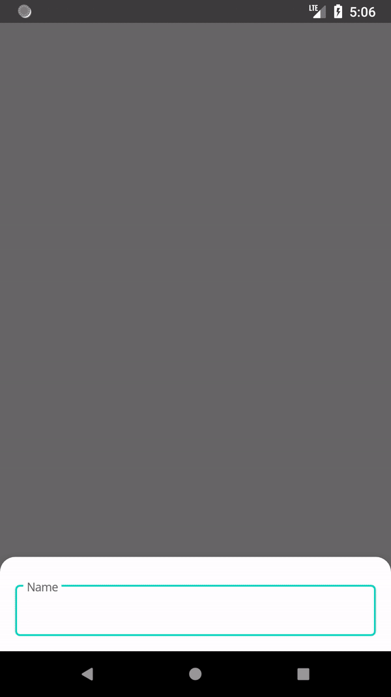

# NewsSync
A sample, offline first, Android app written in Kotlin, which lists recent popular news around the world, based on user input. 
The app allows for multiple inputs and multiple lists which can be viewed offline. Lists get updated every 3 hours if the device is connected to network.

  

## Summary
* MVVM pattern using [RxJava2](https://github.com/ReactiveX/RxJava) and [Architecture components](https://developer.android.com/topic/libraries/architecture)
* Rest API from [NewsApi](https://newsapi.org/)
* Sync news every 3 hours using [WorkManager](https://developer.android.com/topic/libraries/architecture/workmanager)
* Store data using [Room](https://developer.android.com/topic/libraries/architecture/room)
* Fragment navigation with [Navigation Component](https://developer.android.com/topic/libraries/architecture/navigation)

## Libraries
* Architecture components
  * LiveData
  * ViewModel
  * Room
  * WorkManager
  * Navigation
* RxJava2
* Dagger2
* ThreeTenABP
* JUnit
* Mockito
* Mockito-Kotlin

## Usage
* Clone this repo directly:
~~~~ 
git clone https://github.com/dimkonomis/NewsSync.git
~~~~
* Get your Api key from [NewsApi](https://newsapi.org/) and replace it [here](https://github.com/dimkonomis/NewsSync/blob/master/app/src/main/java/com/dk/newssync/data/source/network/NetworkHeadersInterceptor.kt)
